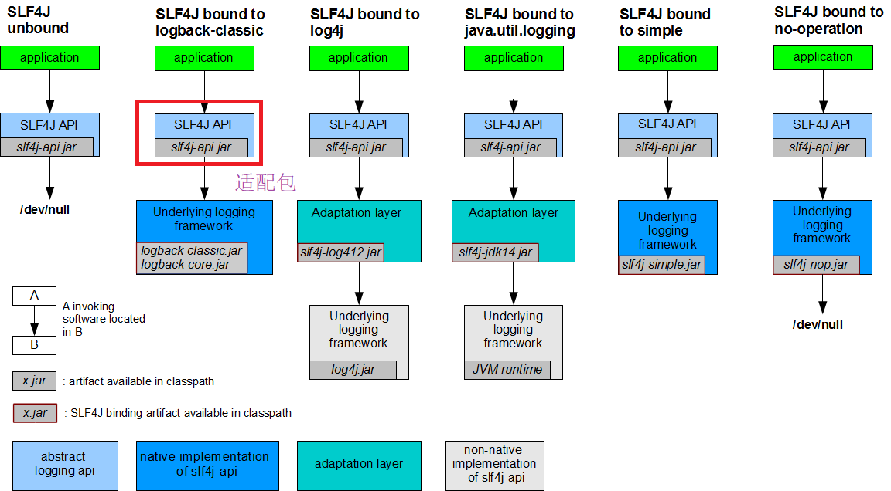
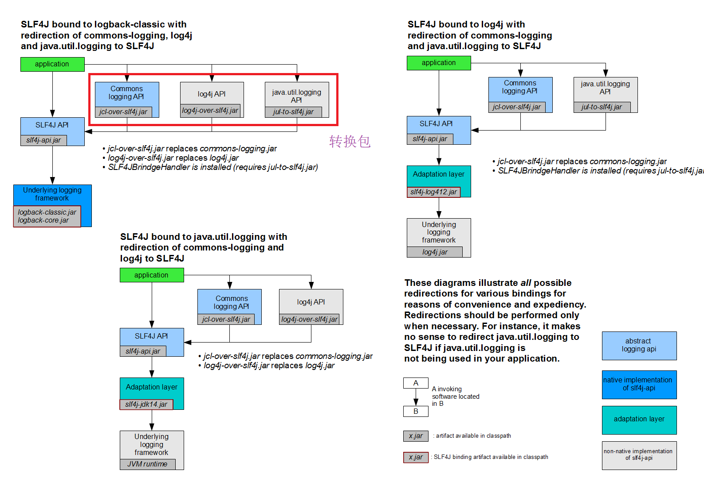
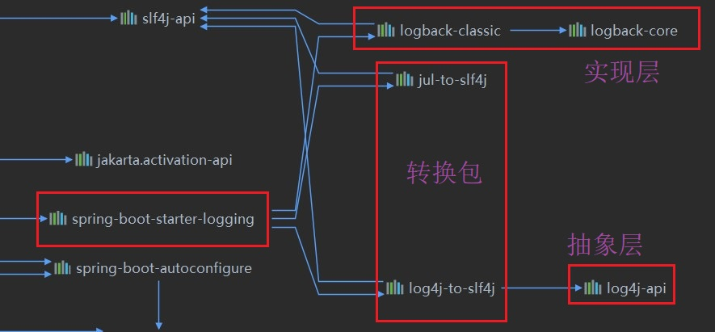
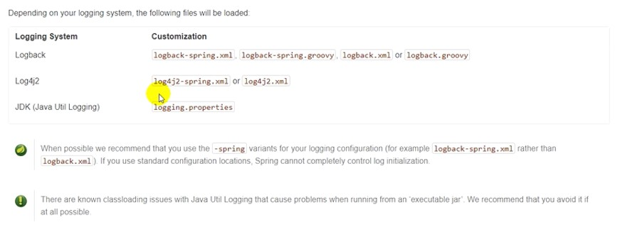
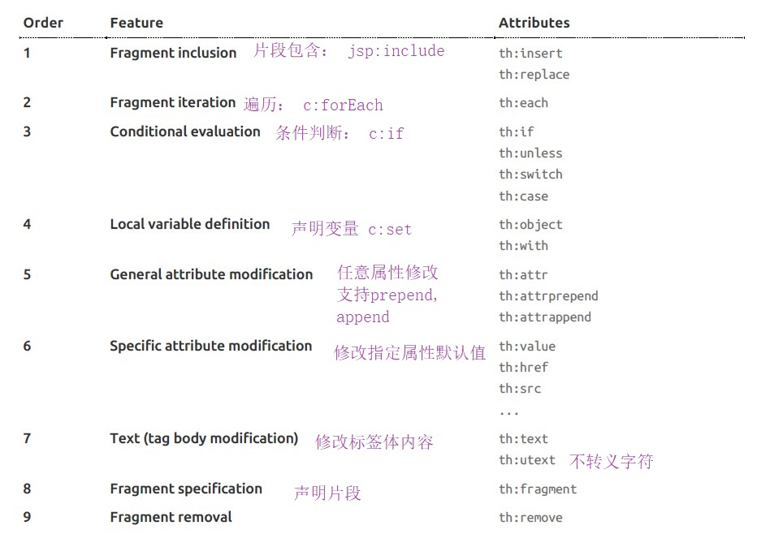

[TOC]
## 一、springboot

- 开发流程
    - 创建一个maven工程
    - 导入springboot相关的依赖
    - 编写主程序，是启动springboot应用的
    - 编写相关的controller、service，无需配置
    - 运行主程序

- 部署流程
    - 导入maven插件
    - 打包成jar包，在命令行执行"java -jar"命令可运行起来
    - 目标服务器无需安装tomcat，jar包中自带tomcat环境

- Pom文件
    - 父项目<parent>还有父项目，管理springboot的所有依赖版本
    - 导入的依赖：spring-boot-starter-web，springboot的一个
        场景启动器，导入web模块运行需要的组件

- 主程序类
    - @SpringBootApplication，标记主程序是springboot应用程序，包含：
      - @SpringBootConfiguration，配置类
      - @EnableAutoConfiguration，开启自动配置功能
      - 将主配置类（@SpringBootApplication标记的类）的包及下面子包中的所有组件扫描到Spring容器

## 二、配置文件

- 全局配置文件
    - application.properties
    - application.yml

- yml语法
    - k: v （中间的空格不能少）
    - 左对齐的是同一层级的，缩进的矮一级
    - 区分大小写，字符串无需加引号
```yml
a. 基本数据类型(&包装类)
server:
  port: 8090
  path: /hi

b. 引用数据类型
person:
    name: liu
    age: 20
或
person: {name: liu, age: 20}

c. 数组\集合
pets:
    - cat
    - dog
    - fish
或
pets: {cat,dog,fish}
```
- 全局配置文件、指定配置文件
    - @PropertySource(value = {"classpath: person.properties"})     //从指定配置文件获取初始值
    - @ConfigurationProperties(prefix = "person")     //从全局配置文件获取初始值

- 配置文件占位符
    - ${}
    - 可以给属性赋值为随机数(person.age=${random.int})
    - 可以给定默认值，找不到其他值的时候生效(${person.name:liu})

- Profile
    - 多Profile文件：application.properties(默认环境),application-dev.properties(生产环境),application-test.properties(测试环境)
        - 切换到测试环境：在application.properties中添加=>spring.profiles.active=test
        - 命令行方式切换到测试环境：打包(只能打包src文件夹下的文件) =>运行jar包 => --spring.profiles.active=test
    - application.yml文件可使用多文档块(---)，多个环境写在同一个文件中

- 配置文件的优先级（不同位置的）
  - 由高到低：
    - file:/config/   //当前工程根目录下的config文件夹中
    - file:/          //当前工程根目录下
    - classpath:/config/    //resources目录下的config文件夹中
    - classpath:/           //resources目录下
  - 高优先级覆盖低优先级，但4个位置的主配置文件都会加载。相同部分，低优先级的被覆盖；不同部分，低优先级的仍然有效（互补配置）
  - 命令行方式指定配置文件：运行jar包 => --spring.config.location=xxx.properties(带上全路径)    ,该文件可以在任意盘的任意位置下，

- 外部配置文件加载顺序
    - 高优先级覆盖低优先级，所有配置文件形成互补配置
      - 命令行参数(适合配置参数很少的情况)
      - ...
      - application-dev.properties、application-test.properties等文件(application.yml:带spring.profile的配置文件)(先jar包外部后内部)
      - application.properties文件(application.yml:不带spring.profile的配置文件)(先jar包外部后内部)
      - spring.profile=dev  //该配置文件在生产环境下使用

- 自动配置原理
    - springboot启动的时候加载主配置类，开启主配置功能@EnableAutoConfiguration
    - 将jar包下（spring-boot-autoconfigure-2.1.14.RELEASE.jar/META-INF/spring.factories）的EnableAutoConfiguration的值加入到容器中
    - 这些值包括：
      - org.springframework.boot.autoconfigure.admin.SpringApplicationAdminJmxAutoConfiguration,\
      - org.springframework.boot.autoconfigure.aop.AopAutoConfiguration,\
      - org.springframework.boot.autoconfigure.amqp.RabbitAutoConfiguration,\
      - ...
    - 它们（xxxAutoConfiguration）都是自动配置类，自动执行配置功能
    - 以HttpEncodingAutoConfiguration为例：

```java
@Configuration  //当前的类是一个配置类
@EnableConfigurationProperties(HttpProperties.class)    //启用指定的配置类(该类相当于一个配置文件,自己写的配置文件能配哪些东西，由它里面的方法/属性决定)
@ConditionalOnWebApplication(type = ConditionalOnWebApplication.Type.SERVLET)//判断当前是不是web应用
@ConditionalOnClass(CharacterEncodingFilter.class)//判断当前项目有没有这个类
@ConditionalOnProperty(prefix = "spring.http.encoding", value = "enabled", matchIfMissing = true)//判断配置文件中有没有spring.http.encoding.enabled,没有也生效
public class HttpEncodingAutoConfiguration {...}


@ConfigurationProperties(prefix = "spring.http") //指定配置的对象：spring.http
public class HttpProperties {...}//该类中指定了spring.http对象的可配置属性

```
- 自动配置的使用
    - springboot自动加载大量的自动配置类（xxxAutoConfiguration-->xxxProperties.class）
    - 根据需要的功能看看springboot有没有已经写好的配置类
    - 该配置类中现成的属性，可拿过来用，没有的需要自己写
    - 查看项目启用了（or没启用）哪些自动配置类: 配置文件添加 debug=true --> 运行-->在控制台查看报告（ CONDITIONS EVALUATION REPORT）

## 三、日志
- SLF4j、logback
- 使用时应先调用抽象层（SLF4j）的方法
  - 导入SLF4j的jar-->导入logback的jar
  - 导入SLF4j的jar-->导入适配层的jar-->导入其他实现层的jar
- 配置文件根据具体的实现层来写
  


- 统一所有日志到SLF4j
  - 导入SLF4j的jar-->使用转换包替换原框架的包-->导入适配层的jar-->导入其他实现层的jar
  


```java
import org.slf4j.Logger;   
import org.slf4j.LoggerFactory;     

public class HelloWorld {
  public static void main(String[] args) {
    Logger logger = LoggerFactory.getLogger(HelloWorld.class);
    logger.info("Hello World");
  }
}
```
- springboot日志依赖关系
  - 底层使用SLF4j+logback记录日志
  - 使用转换包把其他日志转换为SLF4j
  - 若要引入其他框架，需要把其他框架的默认日志框架排除掉(exclusion)



- 常用语句
  - LoggerFactory.getLogger --> logger.info...
  - 配置文件中：
    - logging.file  日志保存到指定的文件
    - logging.level
    - logging.path  指定路径，会自动生成一个日志文件
```java
    //记录器
    Logger logger = LoggerFactory.getLogger(getClass());

        //日志的级别由低到高 trace<debug<debug<warn<error
        logger.trace("这是trace日志...");
        logger.debug("这是debug日志...");

        //默认输出info级别以上的日志，可在配置文件中设置
        logger.info("这是info日志...");
        logger.warn("这是warn日志...");
        logger.error("这是error日志...");
```

```java
//在配置文件中设置日志的输出
logging.level.com.example=trace
logging.file=D:\\GithubRepository\\mavenTest\\springboot-03-log\\logTest\\springboot.log

//在根目录下创建文件夹/spring/log，然后在里面写入默认名为springboot.log的文件
logging.path=/spring/log

//格式化输出
//logging.pattern.console=
//logging.pattern.file=
```
- 自定义配置文件(命名)
  - logback-spring.xml：框架不加载日志的配置项，由springboot解析，可以使用高级profile功能(开发环境输出的日志是一种格式，测试环境是另一种格式)，推荐使用这个来命名(然后把该文件放在类路径下即可)
  - logback.xml： 直接被日志框架所识别
  


## 四、web开发
- 流程 
  - 用initializr创建springboot应用，选择需要的模块
  - 根据场景写配置文件
  - 写业务代码
- 静态资源的映射规则(I)-->webjars(公共资源、以jar包的方式引入资源)（https://www.webjars.org/）
  - pom文件引入依赖
  - 所有/webjars/**，都去classpath: META-INF/resources/webjars/下找资源
  - 直接访问它的资源：localhost:8080/webjars/jquery/3.5.1/jquery.js
  
```
    //pom文件引入依赖
        <!--引入jquery-webjar -->
        <dependency>
            <groupId>org.webjars</groupId>
            <artifactId>jquery</artifactId>
            <version>3.5.1</version>
        </dependency>
```

```java
		@Override
		public void addResourceHandlers(ResourceHandlerRegistry registry) {
			if (!this.resourceProperties.isAddMappings()) {
				logger.debug("Default resource handling disabled");
				return;
			}
      //resourceProperties可设置静态资源相关的参数，如缓存时间等
			Duration cachePeriod = this.resourceProperties.getCache().getPeriod();
			CacheControl cacheControl = this.resourceProperties.getCache().getCachecontrol().toHttpCacheControl();
			if (!registry.hasMappingForPattern("/webjars/**")) {
				customizeResourceHandlerRegistration(registry.addResourceHandler("/webjars/**")
						.addResourceLocations("classpath:/META-INF/resources/webjars/")
						.setCachePeriod(getSeconds(cachePeriod)).setCacheControl(cacheControl));
			}
			String staticPathPattern = this.mvcProperties.getStaticPathPattern();
			if (!registry.hasMappingForPattern(staticPathPattern)) {
				customizeResourceHandlerRegistration(registry.addResourceHandler(staticPathPattern)
						.addResourceLocations(getResourceLocations(this.resourceProperties.getStaticLocations()))
						.setCachePeriod(getSeconds(cachePeriod)).setCacheControl(cacheControl));
			}
		}

		private Integer getSeconds(Duration cachePeriod) {
			return (cachePeriod != null) ? (int) cachePeriod.getSeconds() : null;
		}

		private void customizeResourceHandlerRegistration(ResourceHandlerRegistration registration) {
			if (this.resourceHandlerRegistrationCustomizer != null) {
				this.resourceHandlerRegistrationCustomizer.customize(registration);
			}
		}
```

- 静态资源的映射规则(II)-->/**(自己的资源)
  - 访问当前项目下的任何资源
  - classpath是类路径(src文件夹下)，例如：src/main/java或src/main/resources，其下创建文件夹：
      - "classpath:/META-INF/resources/"
    	- "classpath:/resources/"
    	- "classpath:/static/"(已有)
    	- "classpath:/public/"
	- 将静态资源放在上述文件夹下，springboot可自动访问
    	- 例如在static下新建文件夹assets
    	- 访问：localhost:8080/assets/jquery1.js（自动访问，无需写static）
- 主页的访问：自动查找上述4个文件夹下的"index.html"文件
- 图标
    - 所有的**/favicon.ico都在静态资源文件夹下找
  
- thymeleaf模板引擎（springboot不能直接用jsp页面）
    - pom文件引入依赖
    - 把html页面放在templates文件夹下即可

```
    //引入依赖
        <!--引入thymeleaf -->
        <dependency>
            <groupId>org.springframework.boot</groupId>
            <artifactId>spring-boot-starter-thymeleaf</artifactId>
        </dependency>
```

- thymeleaf的使用
    - 添加 <html lang="en" xmlns:th="http://www.thymeleaf.org">
    - 语法
        - th: text ,改变当前元素的文本内容
            - th， html的任意属性
- 表达式
```
I）Simple expressions:
      1. Variable Expressions: ${...} 
                获取变量值：OGNL
                1）获取对象的属性、调方法
                2）使用内置的基本对象
                #ctx : the context object.
                #vars: the context variables.
                #locale : the context locale.
                #request : (only in Web Contexts) the HttpServletRequest object.
                #response : (only in Web Contexts) the HttpServletResponse object.
                #session : (only in Web Contexts) the HttpSession object.
                #servletContext : (only in Web Contexts) the ServletContext object.
                eg: Established locale country: <span th:text="${#locale.country}">US</span>.
                4)内置的工具对象
                #execInfo : information about the template being processed.
                #messages : methods for obtaining externalized messages inside variables expressions, in the same way as they
                would be obtained using #{…} syntax.
                #uris : methods for escaping parts of URLs/URIs
                Page 20 of 106
                #conversions : methods for executing the configured conversion service (if any)
                #dates : methods for java.util.Date objects: formatting, component extraction, etc
                #calendars : analogous to #dates , but for java.util.Calendar objects.
                #numbers : methods for formatting numeric objects.
                #strings : methods for String objects: contains, startsWith, prepending/appending, etc.
                #objects : methods for objects in general.
                #bools : methods for boolean evaluation.
                #arrays : methods for arrays.
                #lists : methods for lists.
                #sets : methods for sets.
                #maps : methods for maps.
                #aggregates : methods for creating aggregates on arrays or collections.
                #ids : methods for dealing with id attributes that might be repeated


      2. Selection Variable Expressions: *{...}  ，跟${ }一样，配合th: object 使用

      <div th:object="${session.user}">
      <p>Name: <span th:text="*{firstName}">Sebastian</span>.</p>
      <p>Surname: <span th:text="*{lastName}">Pepper</span>.</p>
      <p>Nationality: <span th:text="*{nationality}">Saturn</span>.</p>
      </div>

      1. Message Expressions: #{...}  国际化内容
      2. Link URL Expressions: @{...} 定义URL
      3. Fragment Expressions: ~{...} 片段引用
II）Literals (字面量)
      Text literals: 'one text' , 'Another one!' ,…
      Number literals: 0 , 34 , 3.0 , 12.3 ,…
      Boolean literals: true , false
      Null literal: null
      Literal tokens: one , sometext , main ,…
III）Text operations(文本操作):
      String concatenation: +
      Literal substitutions: |The name is ${name}|
IV）Arithmetic operations（数学运算）:
      Binary operators: + , - , * , / , %
      Minus sign (unary operator): -
      Boolean operations:
      Binary operators: and , or
      Boolean negation (unary operator): ! , not
V）Comparisons and equality(比较运算):
      Comparators: > , < , >= , <= ( gt , lt , ge , le )
      Equality operators: == , != ( eq , ne )
VI）Conditional operators(条件运算):
      If-then: (if) ? (then)
      If-then-else: (if) ? (then) : (else)
      Default: (value) ?: (defaultvalue)
VII）Special tokens:
      No-Operation: _
```



- 使用springMVC框架
    - Spring自动配置了以下功能：
        - 视图解析器（ViewResolver）：ContentNegotiatingViewResolver和BeanNameViewResolver
            - ContentNegotiatingViewResolver：组合所有视图解析器
            - 定制：给容器添加自己的视图解析器，自动组合进来（**自己写的，加上@Bean/@Componet就行了**）
        - 支持服务静态资源，包括对WebJars的支持
        - 自动注册Converter，GenericConverter和Formatter
            - Converter：转换器，类型转换，把int转换为Integer等
            - Formatter：格式化器，把时间日期对象格式化
            - 定制：自己写的Converter、Formatter，加上@Bean/@Componet就行了
        - 支持HttpMessageConverters（用来转换http请求和响应）
            - 定制：自己写的HttpMessageConverters,加上@Bean/@Componet就行了
        - 自动注册MessageCodesResolver(可定制)
        - 静态index.html首页
        - 定制Favicon图标
        - 自动使用ConfigurableWebBindingInitializer bean(可定制)
  
```java
//定制的会自动添加的原理：先用@ConditionalOnMissingBean判断，没有才new一个系统自带的，并返回
		@Bean
		@ConditionalOnBean(ViewResolver.class)
		@ConditionalOnMissingBean(name = "viewResolver", value = ContentNegotiatingViewResolver.class)  //判断有没有
		public ContentNegotiatingViewResolver viewResolver(BeanFactory beanFactory) {
			ContentNegotiatingViewResolver resolver = new ContentNegotiatingViewResolver();   //new一个系统自带的
			resolver.setContentNegotiationManager(beanFactory.getBean(ContentNegotiationManager.class));
			// ContentNegotiatingViewResolver uses all the other view resolvers to locate
			// a view so it should have a high precedence
			resolver.setOrder(Ordered.HIGHEST_PRECEDENCE);
			return resolver;  //返回系统自带的
		}
```
- 扩展springMVC
    - 保留springboot的自动配置，并且添加自己的配置
    - 编写配置类（添加@configuration),实现**WebMvcConfigurer**类，重写方法，但不加 @EnableWebMvc
    - 完全控制Spring MVC，可以添加自己的@Configuration，注释@EnableWebMvc
        - 不用自动配置的东西，全部自己配置，web模块所有自动配置全部失效，静态页面也不能访问
    - **xxxConfigurer**是扩展配置类
  
- 1) crud实验
    - html页面放在templates文件夹下，其他资源(如css、img、jss)放在静态资源的文件夹下
    - 默认访问首页

- 2) 国际化(根据浏览器默认语言而变化)
      - 分别编写中英文的配置文件（添加resource bundle，局部配置文件中）
      - 设置spring.messages.basename=i8n.login (application.properties中)
      - 去页面获取国际化的值(html页面中添加 th:text="#{login.username}" )

- 3) 国际化-->点击“中文”、“英文”实现中英文切换的国际化效果
      - 写自己的LocaleResolver(写出一个单独的类)
      - 注册到容器(扩展springMVC而写的配置类中)

```java
//写自己的区域解析器 ，点击“中文”、“英文”实现中英文切换的国际化效果
public class MyLocaleResolver implements LocaleResolver
{
    @Override
    public Locale resolveLocale(HttpServletRequest request)
    {
        String l = request.getParameter("l");
        Locale locale= Locale.getDefault();
        if (!StringUtils.isEmpty(l))
        {
            String[] s = l.split("_");
            locale=new Locale(s[0],s[1]);
        }
        return locale;
    }

    @Override
    public void setLocale(HttpServletRequest httpServletRequest, HttpServletResponse httpServletResponse, Locale locale)
    {

    }
}
...
    @Bean    //把自己写的区域视图解析器加入到容器中
    public LocaleResolver localeResolver()
    {
        return new MyLocaleResolver();
    }
```
- 小技巧
    - IDEA的改动即时生效
        - 禁用缓存(spring.thymeleaf.cache=false,全局配置文件中)
        - 重新编译(Build-->Build Project，仅限前端的html页面，后端的仍需Rerun)

- 4) 登录、登录检测
    - 登录
        - 写一个用于登录的controller类
    - 登录检测
        - 写一个用于登录的HandlerInterceptor(类)
        - 在自定义的配置类中注册

```java
//登录检测
    //写一个用于登录的HandlerInterceptor(类)
public class LoginHandlerInterceptor implements HandlerInterceptor
{
    //目标方法执行之前
    @Override
    public boolean preHandle(HttpServletRequest request, HttpServletResponse response, Object handler) throws Exception
    {
        Object loginUser = request.getSession().getAttribute("loginUser");
        if (loginUser==null)
        {
            //未登录，返回登录页面
            request.setAttribute("msg","无权限，先登录");
            request.getRequestDispatcher("/index.html").forward(request,response);
            return false;
        }
        else
        {
            //登录，放行
            return true;
        }
    }
}
...
    //在自定义的配置类中注册
            //注册拦截器
            @Override
            public void addInterceptors(InterceptorRegistry registry)
            {
                registry.addInterceptor(new LoginHandlerInterceptor()).addPathPatterns("/**")
                        .excludePathPatterns("/index.html", "/", "/user/login");
            }
```
- 4) CRUD-员工列表
    - 实验要求：
        - 1） Restful CRUD: 满足Rest风格

|     | 普通CRUD               | Restful CRUD     |
| --- | ---------------------- | ---------------- |
| 增  | addEmp?xxx             | emp--POST        |
| 删  | deleteEmp?id=1         | emp/{id}--DELETE |
| 改  | updateEmp?id=xxx&XX=xx | emp/{id}--PUT    |
| 查  | getEmp                 | emp--GET         |

        - 2） 实验的请求架构

|              | 请求URI  | 请求方式 |
| ------------ | -------- | -------- |
| 查询所有员工 | emps     | GET      |
| 查询指定员工 | emp/{id} | GET      |
| 来到添加页面 | emp      | GET      |
| 添加员工     | emp      | POST     |
| 来到修改页面 | emp/{id} | GET      |
| 修改员工     | emp      | PUT      |
| 删除员工     | emp{id}  | DELETE   |

    - 员工列表：
        - thymeleaf公共页面元素抽取
            - 抽取公共片段
            - 引入片段
            - 可以将公共片段(比如导航栏)写在一个单独的html文件中，子页面分别引入
- 错误处理机制
    - 默认处理
        - 浏览器：返回一个报错的页面，如404
        - app：返回json数据
    - 定制
        - 定制网页  
            - 1)有模板引擎(精确匹配)：error/404.html,即把404.html放在templates/error/文件夹下，自动生效
            - 2)有模板引擎(模糊匹配)：error/4xx.html,即把4xx.html放在templates/error/文件夹下，则所有的4xx错误均跳转到此页面
            - 3）没有模板引擎，或templates文件夹下没用相应的报错页面，则自动去静态文件夹(的error文件夹)下找
        - 定制json数据

    - 原理
        - ErrorMvcAutoConfiguration

- 定制嵌入式的Servlet容器
    - 默认使用的是tomcat
    - 通用设置：在application.properties中-->server.xxx，如server.port=8000
    - tomcat设置：server.tomcat.xxx
    - 注册Servlet、Filter、Listener:ServletRegistrationBean,FilterRegistrationBean,ServletListenerRegistrationBean

- 其他Servlet容器
    - Jetty(长连接，一直保持连接状态)
    - Undertow(高性能，不支持JSP)
    - 方法
        - pom文件中排除tomcat
        - 引入依赖

```xml
<!--        排除tomcat容器-->
                <exclusion>
                    <artifactId>spring-boot-starter-tomcat</artifactId>
                    <groupId>org.springframework.boot</groupId>
                </exclusion>
<!--        引入Jetty容器-->
        <dependency>
            <artifactId>spring-boot-starter-jetty</artifactId>
            <groupId>org.springframework.boot</groupId>
        </dependency>

```
## 五、Docker
- 概念
    - docker主机(Host)：安装了docker的机器
    - docker客户端(Client)：连接主机的软件
    - docker仓库(Registry)：保存各种打包好的软件镜像
    - docker容器(Container)：镜像启动后的一个实例,一个运行中的应用

- 使用docker步骤
    - 安装docker
    - 去仓库下载镜像
    - 运行镜像，得到一个docker容器
    - 对容器的启动、停止，就是对软件的启动、停止

- docker命令
    - docker
        - systemctl start docker
        - systemctl stop docker
        - systemctl enable docker 开机自启
    - 镜像、容器
        - docker search tomcat (去docker hub网站搜索详细信息)
        - docker pull tomcat/ docker pull  tomcat: [tag]
        - docker images 显示已有的镜像
        - docker run tomcat: [tag]
        - docker stop [id]
        - docker ps -a 显示所有的容器 /docker ps 显示运行的容器
        - docker run -d -p 8888:8080  (-d 后台运行，-p 将主机端口映射到容器端口)
        - docker logs 
        - docker rm 删容器 / docker rmi 删镜像
```
启动mysql:
docker run -p 3306:3306 --name mysqlLatest -v /etc/docker_configs/mysql:/etc/mysql/conf.d  -e MYSQL_ROOT_PASSWORD=a02c00f1  -d mysql 
```
## 六、数据访问
- 访问数据库只需在全局配置文件中加入配置：

```
spring.datasource.username=root
spring.datasource.password=a02c00f1
spring.datasource.url=jdbc:mysql://182.92.78.192:3306/jdbc
spring.datasource.driver-class-name=com.mysql.cj.jdbc.Driver
```
- 使用指定的sql文件(如dep.sql),需在全局配置文件中添加：spring.datasource.schema=classpath:dep.sql

## 七、 Deploy SpringBoot Project :

- 用Dockerfile把项目(*.jar)制作成镜像，运行起来
  
- Dockerfile(在 /root/web 文件夹下):
```
touch Dockerfile
...
FROM openjdk:11.0.7-jdk
ARG JAR_FILE=springboot-web.jar
COPY ${JAR_FILE} /root/web/app.jar
ENTRYPOINT ["java","-jar","/root/web/app.jar"]
```
- 创建镜像：
```
cd /root/web  //打开Dockerfile所在文件夹
docker build -t myapp .
```
- 启动容器：
```
docker run -d -p 8080:8080 myapp
```
- 访问：
```
http://182.92.78.192:8080/
```
## 八、 编写 REST Controller
- GET

```java
//请求一个包含 taco 设计的列表
@RestController //有@RestController，无需Model。它告诉 Spring，控制器中的所有处理程序方法都
                //应该将它们的返回值直接写入响应体，而不是在模型中被带到视图中进行呈现
@RequestMapping(path="/design", produces="application/json")    // produces 指定了 DesignTacoController 中的任何处理程序方法只
                                                        //在请求的 Accept 头包含 “application/json” 时才处理请求
                                                        //这限制了 API 只生成 JSON 结果
@CrossOrigin(origins="*")   //@CrossOrigin 允许来自任何域的客户端使用 API(Web、手机都行?)
public class DesignTacoController {

    private TacoRepository tacoRepo;

    @Autowired
    EntityLinks entityLinks;

    public DesignTacoController(TacoRepository tacoRepo) {
        this.tacoRepo = tacoRepo;
    }

    @GetMapping("/recent")  // 处理 /design/recent 接口的 GET 请求
    public Iterable<Taco> recentTacos() {
        PageRequest page = PageRequest.of(
            0, 12, Sort.by("createdAt").descending());
        return tacoRepo.findAll(page).getContent();
    }
}
```

- POST
  
```java
@PostMapping(consumes="application/json")   
// consumer 属性用于处理输入，那么 produces 就用于处理输出。这里使用 consumer 属性，表示该方法只处理 
// Content-type 与 application/json 匹配的请求
@ResponseStatus(HttpStatus.CREATED) //状态 201（CREATED）告诉客户机，请求不仅成功了，而且还创建了一个资源
public Taco postTaco(@RequestBody Taco taco) {  
//@RequestBody 注解确保将请求体中的 JSON 绑定到 Taco 对象。
//如果没有它，Spring MVC 会假设将请求参数（查询参数或表单参数）绑定到 Taco 对象(有什么区别?)
    return tacoRepo.save(taco);
}
```
- PUT

```java
@PutMapping("/{orderId}")
public Order putOrder(@RequestBody Order order) {
return repo.save(order);
}
```
- DELETE

```java
@DeleteMapping("/{orderId}")
@ResponseStatus(code=HttpStatus.NO_CONTENT)
public void deleteOrder(@PathVariable("orderId") Long orderId) {
try {
repo.deleteById(orderId);
} catch (EmptyResultDataAccessException e) {}
}
```

## 九、使用 RestTemplate 调用 REST 端点
- 使用范围?
```java
@Bean  //实例化并注册到容器
public RestTemplate restTemplate() {
return new RestTemplate();
}
```
- GET

```java
//通过ID获取一个 Ingredient 对象
public Ingredient getIngredientById(String ingredientId) {
return rest.getForObject("http://localhost:8080/ingredients/{id}",
Ingredient.class, ingredientId);
}
```
- POST
  
```java
public Ingredient createIngredient(Ingredient ingredient) {
return rest.postForObject("http://localhost:8080/ingredients",
ingredient,
Ingredient.class);
}
```
- PUT

```java
public void updateIngredient(Ingredient ingredient) {
rest.put("http://localhost:8080/ingredients/{id}",
ingredient,
ingredient.getId());
}
```

- DELETE

```java
public void deleteIngredient(Ingredient ingredient) {
rest.delete("http://localhost:8080/ingredients/{id}",
ingredient.getId());
}
```

0709
10